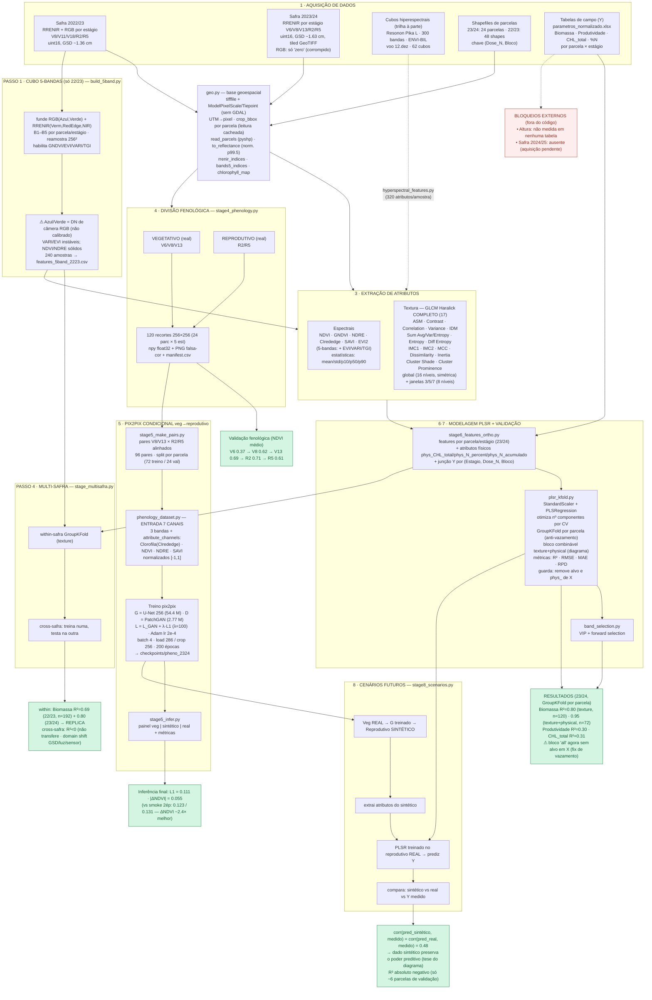

# Fluxograma completo do pipeline milho (etapas 1–8 + roteiro 1–4)

> ⚠️ Resultados honestos e correções em [`RESULTS_STATUS.md`](RESULTS_STATUS.md)
> (Produtividade, etapa 8, teto da GAN; + pooled e adaptação de domínio inter-safra).

Diagrama técnico de tudo que foi implementado, com especificações e resultados.
CRS de todos os produtos geoespaciais: **SIRGAS 2000 / UTM 22S (EPSG:31982)**.

## Especificações técnicas resumidas

| Componente | Especificação |
|---|---|
| **CRS / geo** | SIRGAS 2000 UTM 22S (EPSG:31982); leitura `tifffile` + tags GeoTIFF; sem GDAL |
| **RRENIR** | 3 bandas uint16 [Red, RedEdge, NIR]; tiled 256; GSD 1.63 cm (23/24) / 1.36 cm (22/23) |
| **RGB** | 3 bandas uint16 [R, G, B]; só 22/23 por estágio |
| **Índices** | NDVI, GNDVI, NDRE, CIrededge, SAVI, EVI2 (+ EVI, VARI, TGI no 5-bandas) |
| **GLCM** | Haralick 17 descritores; matriz simétrica; global 16 níveis + janelas 3/5/7 (8 níveis) |
| **GAN** | pix2pix; G U-Net256 (54.4 M), D PatchGAN (2.77 M); input_nc=7, output_nc=3; L_GAN+λL1 (λ=100); Adam 2e-4; 200 épocas |
| **Condicionamento** | 4 canais de atributos: Clorofila(CIrededge), NDVI, NDRE, SAVI (`attribute_channels`) |
| **PLSR** | StandardScaler + PLSRegression; GroupKFold por parcela; R²/RMSE/MAE/RPD; VIP forward; bloco combinável texture+physical; guarda anti-vazamento (alvo e phys_<alvo> fora de X) |
| **Deps (user-site)** | tifffile, pyshp, openpyxl, dominate, wandb (torch 2.11 + CUDA) |

## Resultados consolidados

| Etapa | Métrica | Valor |
|---|---|---|
| 4 Fenologia | NDVI V6→R2→R5 | 0.37 → 0.71 → 0.61 (coerente) |
| 5 GAN | L1 / ΔNDVI (val) — 200 ép | 0.1115 / 0.0546 |
| 5 GAN | L1 / ΔNDVI (val) — 2000 ép (doce spot) | 0.1026 / 0.0461 (-7.9% / -15.6%) |
| 5 GAN | L1 / ΔNDVI (val) — 4000 ép | 0.1029 / 0.0470 (platô vs 2000; D colapsa) |
| 6-7 PLSR 23/24 | Biomassa R² (texture / texture+physical) | 0.80 (n=120) / 0.95 (n=72) |
| 6-7 PLSR 23/24 | Produtividade / CHL R² | 0.30 / 0.31 |
| 8 Cenários | corr(sintético,medido) vs corr(real,medido) | 0.48 = 0.48 |
| 4-passo Multi-safra | Biomassa within (22/23 / 23/24) | 0.69 / 0.80 |
| 4-passo Multi-safra | cross-safra | R²<0 (não transfere) |

**Distância ao diagrama: ~90%.** Etapas 1–8 rodando em 22/23+23/24; falta apenas dado externo
(altura, safra 24/25). Ressalva: 24–48 parcelas ⇒ GAN e etapa 8 são proof-of-mechanism.
