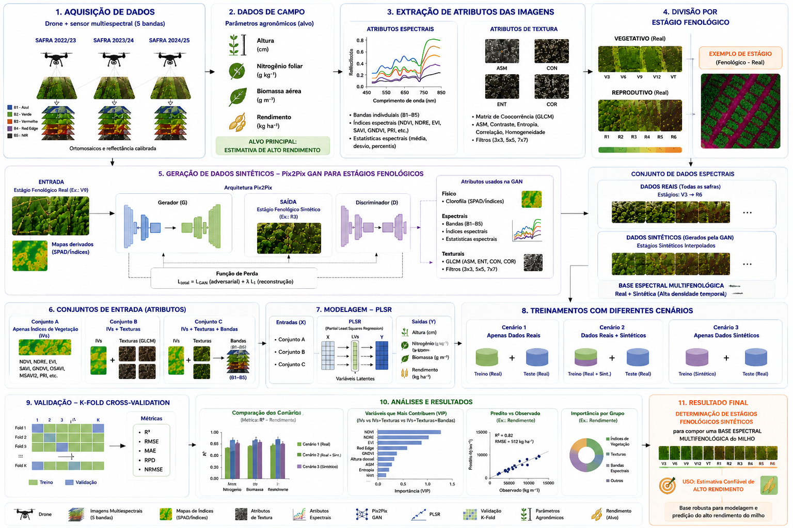

# Pipeline de referência



O código próprio segue as onze etapas do diagrama em
`src/milho_experiment/pipeline/stage_01_*` a `stage_11_*`.

| Etapa | Responsabilidade |
|---:|---|
| 01 | Aquisição e proveniência |
| 02 | Dados de campo |
| 03 | Atributos espectrais e textura |
| 04 | Fenologia |
| 05 | Síntese fenológica/GAN |
| 06 | Conjuntos de entrada |
| 07 | Modelagem agronômica |
| 08 | Cenários de predição |
| 09 | Validação |
| 10 | Análise |
| 11 | Resultados |

As receitas são organizadas em `configs/stages/`. Execute uma delas com:

```bash
python3 scripts/abc_run.py --config configs/stages/07_modeling/2324_multisafra.toml --dry-run
```

Dados brutos permanecem em `data/raw/safra_*/` e resultados em
`artifacts/runs/<run-id>/`; ambos são preservados para manter a rastreabilidade histórica.
